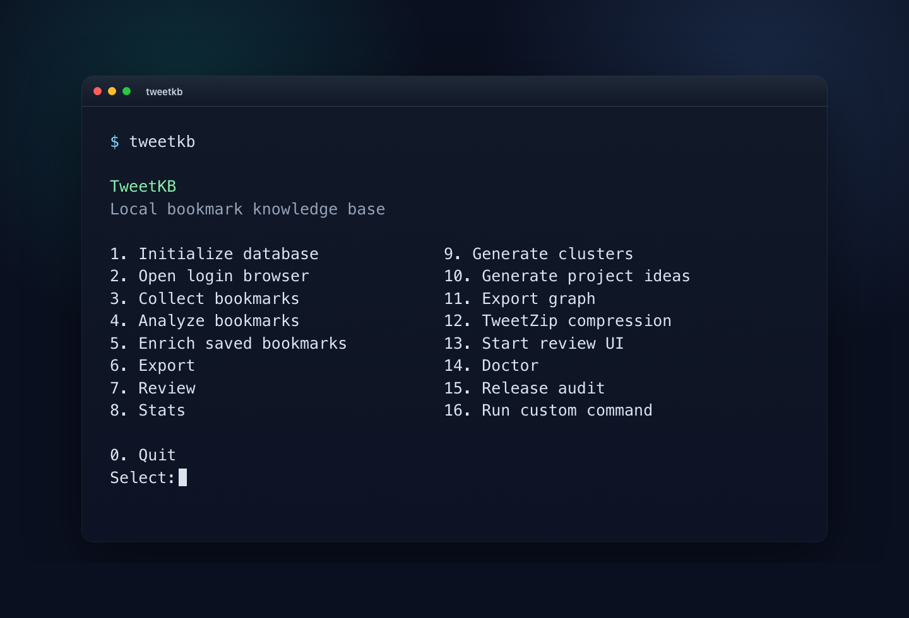
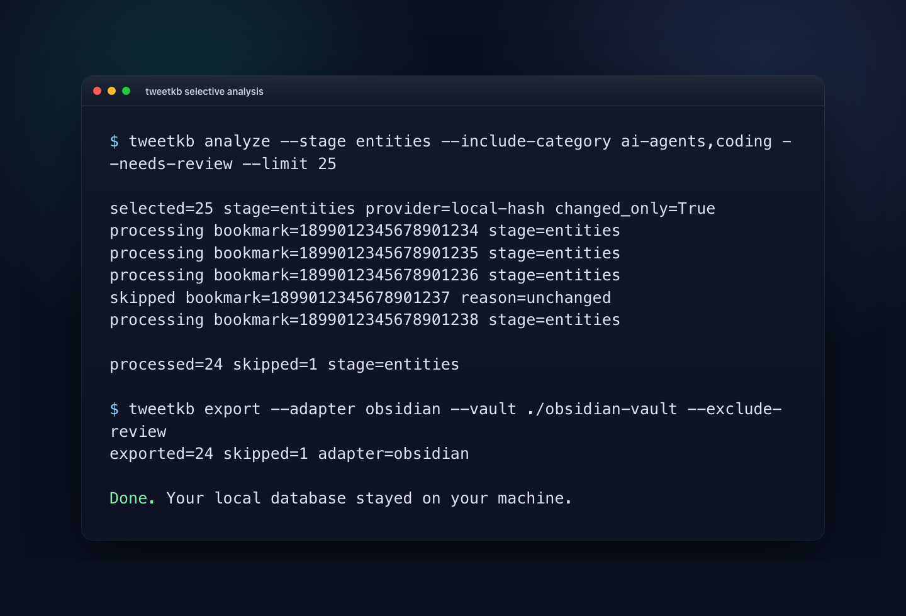

# TweetKB

Private X/Twitter bookmark knowledge base. Local SQLite. Terminal-first.

TweetKB turns saved X/Twitter bookmarks into something you can search, review,
classify, enrich, and export. It reads bookmarks from your logged-in browser,
stores them locally, and writes portable notes for Obsidian, Logseq, Markdown,
JSONL, or CSV.

It does not ship with a bookmark database. It does not upload your archive. It
does not need your X/Twitter password.

## What it does

- Collects bookmarks from a logged-in browser session
- Stores everything in a local SQLite database
- Classifies bookmarks into useful categories
- Lets you analyze only selected categories or review states
- Extracts entities, links, summaries, and local embeddings
- Enriches saved posts and optional outbound links
- Exports to Obsidian, Logseq, Markdown, JSONL, and CSV
- Serves a small local review UI
- Includes a terminal menu for people who do not want to memorize commands
- Includes a release audit to catch private paths, runtime data, and secrets

## Privacy model

TweetKB is built around a simple rule: your bookmark archive stays yours.

- The repository tracks only `data/.gitkeep`, not a database.
- Runtime data stays under `data/` by default and is ignored by git.
- Export folders such as `obsidian-vault/` and `exports/` are ignored.
- Browser profiles, cookies, `.env`, and local config files are ignored.
- Collection is read-only. It scrolls and reads visible bookmark content.
- It never posts, likes, follows, deletes, messages, or changes account settings.
- Cloud LLM providers are off unless you explicitly enable them.

## Requirements

- Python 3.11 or newer
- `uv`
- Chrome or Chromium for bookmark collection
- `browser-harness` on `PATH` for Browser-Harness collection

Install `uv`:

```bash
curl -LsSf https://astral.sh/uv/install.sh | sh
```

Official `uv` docs: <https://docs.astral.sh/uv/getting-started/installation/>

## Install

Install as a global `uv` tool:

```bash
uv tool install git+https://github.com/AdityaVG13/TweetKB.git
uv tool update-shell
```

Open a new terminal, then run:

```bash
tweetkb init
tweetkb
```

That gives you the direct `tweetkb` command. No `uv run` needed after install.

Use a source checkout when you want to develop, run tests, or inspect the code:

```bash
git clone https://github.com/AdityaVG13/TweetKB.git TweetKB
cd TweetKB
uv sync --extra dev
uv run tweetkb init
```

From a source checkout, run commands with `uv run`:

```bash
uv run tweetkb
uv run tweetkb stats
```

If you install the package into an active Python environment, the command is
available directly as `tweetkb`.

Upgrade a tool install:

```bash
uv tool upgrade tweetkb
```

Optional local config:

```bash
cp tweetkb.example.toml tweetkb.toml
```

`tweetkb.toml` is ignored because it may contain private filesystem paths.

## Start with the menu

Run:

```bash
tweetkb
```

From a source checkout, use `uv run tweetkb`.



The menu can initialize the database, open login Chrome, collect bookmarks,
analyze selected slices, analyze and export to a chosen folder, enrich posts,
export notes, review bookmarks, show stats, generate clusters, mine project
ideas, export graphs, run TweetZip, start the review UI, run doctor checks, and
run the release audit.

Every menu action prints the exact `tweetkb ...` command before running it.
Long-running commands also print progress lines such as selected counts,
bookmark IDs, enrich URLs, and final totals.

## Common workflow

Open the login browser:

```bash
uv run tweetkb login
```

Collect a small batch:

```bash
uv run tweetkb collect --limit 100 --batch-size 20
```

Classify first:

```bash
uv run tweetkb analyze --stage classify
```

Run heavier analysis only where it matters:

```bash
uv run tweetkb analyze --stage entities --include-category ai-agents,coding
uv run tweetkb analyze --stage embed --exclude-category misc --needs-review
```

Export to Obsidian:

```bash
uv run tweetkb export --adapter obsidian --vault ./obsidian-vault
```

Open the local review UI:

```bash
uv run tweetkb serve
```

Then open `http://127.0.0.1:8765`.

## Collection modes

Install Browser-Harness before collecting bookmarks:

```bash
git clone https://github.com/browser-use/browser-harness ~/Developer/browser-harness
cd ~/Developer/browser-harness
uv tool install -e .
browser-harness --setup
browser-harness --doctor
```

TweetKB calls `browser-harness` for the default collection mode. You do not need
to run Browser-Harness manually after setup.

See [Browser-Harness setup](docs/BROWSER_HARNESS.md) for managed Chrome,
normal Chrome, and troubleshooting notes.

Default Browser-Harness collection:

```bash
uv run tweetkb collect --limit 100 --batch-size 20
```

Normal Chrome profile:

```bash
uv run tweetkb chrome-debug
uv run tweetkb collect --normal-chrome --existing-tab --limit 100
```

macOS Apple Events fallback:

```bash
uv run tweetkb collect --apple-events --all --batch-size 10 --wait 1
```

For Apple Events mode, Chrome must allow JavaScript from Apple Events.

## Analyze selected bookmarks

Category filters use existing classifications. Run classification once, then
target later stages:

```bash
uv run tweetkb analyze --stage classify
uv run tweetkb analyze --stage all --limit 100
uv run tweetkb analyze --stage entities --include-category ai-agents,coding
uv run tweetkb analyze --stage embed --exclude-category misc --needs-review
uv run tweetkb analyze --stage all --reviewed
uv run tweetkb analyze-export --stage all --adapter spec --vault ./exports/spec
```



## Enrich saved posts

`enrich` opens saved status URLs in logged-in Chrome and captures long-form post
or article text. It also captures visible thread/reply context by default when
the bookmarked tweet looks like a question, so answers in the discussion become
part of later analysis.

```bash
uv run tweetkb enrich --apple-events --limit 100 --wait 4
uv run tweetkb enrich --apple-events --include-conversation always --max-conversation-items 20
uv run tweetkb enrich --apple-events --include-links --max-links 3
uv run tweetkb analyze --stage all
```

Conversation modes:

- `auto`: capture thread/reply context for question-like bookmarks
- `always`: capture visible thread/reply context for every enriched bookmark
- `never`: capture only the bookmarked status/article

## Export

```bash
uv run tweetkb export --adapter obsidian --vault ./obsidian-vault
uv run tweetkb export --adapter spec --vault ./exports/spec
uv run tweetkb export --adapter markdown --vault ./exports/markdown --exclude-category misc
uv run tweetkb export --adapter jsonl --vault ./exports/jsonl --exclude-review
uv run tweetkb export --adapter csv --vault ./exports/csv --include-category ai-agents,coding,models,tools
```

`spec` writes a static `index.html` with search, category filters, expandable
analysis sections, captured thread/link context, entities, tags, and visible
media metadata. It is meant for browsing the analysis as an interactive local
spec instead of reading plain Markdown files.

## How analysis documents are built

TweetKB builds exports from the local SQLite database:

1. Collection stores the bookmarked status URL, author, visible tweet text, raw
   article text, timestamps, and mentioned links.
2. Enrichment opens saved X URLs in logged-in Chrome. It captures fuller status
   or article text, optional outbound linked pages, question-aware thread/reply
   context, and visible image metadata when the page exposes it.
3. Analysis joins the original tweet text with captured enrichments, hashes that
   combined text for changed-only skips, then classifies categories, extracts
   entities, creates tags/summaries, writes "why it matters", and stores an
   embedding.
4. Export turns the stored analysis into the selected format. Markdown/Obsidian
   write note files. `spec` writes one interactive HTML analysis bundle.

Images are not downloaded, OCRed, or semantically analyzed yet. The spec export
can show image URLs/alt text captured during enrichment, but the current analysis
model is text/link/context based.

## Review

```bash
uv run tweetkb review list --limit 50
uv run tweetkb review approve 1234567890123456789
uv run tweetkb review exclude 1234567890123456789
uv run tweetkb review tag 1234567890123456789 research
uv run tweetkb review junk --limit 25
```

## Compression

TweetZip is an experimental local archive format for bookmark corpora.

```bash
uv run tweetkb compress export --out ./exports/bookmarks.twz
uv run tweetkb compress verify ./exports/bookmarks.twz
uv run tweetkb compress inspect ./exports/bookmarks.twz
```

## Instructions for AI coding agents

Use this when an AI agent is asked to download, install, or verify TweetKB.

```text
You are installing TweetKB from source.

Rules:
- Do not ask for X/Twitter credentials.
- Do not inspect or upload browser cookies, browser profiles, `.env`, `data/`,
  `exports/`, or vault folders.
- Do not run `collect`, `enrich`, `chrome-debug`, or `--normal-chrome` unless
  the user explicitly asks you to operate their browser.
- Use synthetic data for tests.

Install and verify:
1. Ensure `uv` exists. If missing, install it from the official Astral docs.
2. Run: git clone https://github.com/AdityaVG13/TweetKB.git TweetKB
3. Run: cd TweetKB
4. Run: uv sync --extra dev
5. Run: uv run tweetkb --db /tmp/tweetkb-smoke.sqlite3 init
6. Run: uv run tweetkb --help
7. Run: uv run tweetkb
8. Select `0` to quit the menu.
9. Run: uv run pytest
10. Run: uv run ruff check .
11. Run: uv run tweetkb release-audit

Success means the CLI works, the menu opens, tests pass, lint passes, and
release audit passes.
```

Shell-only verification:

```bash
git clone https://github.com/AdityaVG13/TweetKB.git TweetKB
cd TweetKB
uv sync --extra dev
uv run tweetkb --db /tmp/tweetkb-smoke.sqlite3 init
uv run tweetkb --help
printf '0\n' | uv run tweetkb
uv run pytest
uv run ruff check .
uv run tweetkb release-audit
```

## Public release audit

Run this before publishing source or building artifacts:

```bash
uv run tweetkb release-audit
```

For a local folder that may contain ignored databases or vault exports:

```bash
uv run tweetkb release-audit --strict-worktree
```

See [docs/RELEASE.md](docs/RELEASE.md) for the full release checklist.

## Development

```bash
uv sync --extra dev
uv run pytest
uv run ruff check .
uv run python -m compileall src tests tools
uv build
```

## Documentation

- [Architecture](docs/ARCHITECTURE.md)
- [Browser-Harness setup](docs/BROWSER_HARNESS.md)
- [Data model](docs/DATA_MODEL.md)
- [Exports](docs/EXPORTS.md)
- [Privacy](docs/PRIVACY.md)
- [Release](docs/RELEASE.md)
- [Terminal demo](docs/TERMINAL_DEMO.md)
- [Roadmap](docs/ROADMAP.md)
- [Security](SECURITY.md)
