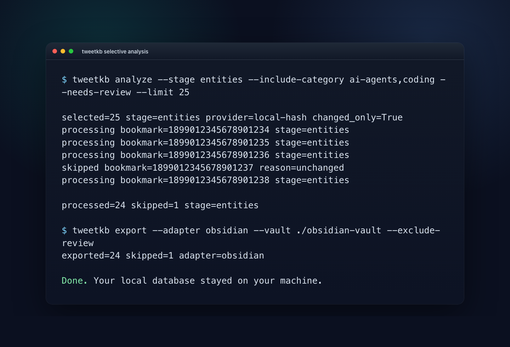

# TweetKB

Private X/Twitter bookmark knowledge base. Local SQLite. Terminal-first.

<p>
  <a href="https://github.com/AdityaVG13/TweetKB/releases/latest"></a>
  <a href="https://github.com/AdityaVG13/TweetKB/blob/main/LICENSE"></a>
  
  <a href="https://ko-fi.com/adityavg13"></a>
</p>

TweetKB turns saved X/Twitter bookmarks into a private knowledge base you can
search, classify, enrich, review, and export. It reads from your logged-in
browser, stores everything in local SQLite, and writes portable notes for
Obsidian, Logseq, Markdown, JSONL, CSV, or a searchable HTML analysis spec.

It ships with no bookmark database, never uploads your archive, and never needs
your X/Twitter password.

| From saved bookmarks | To usable knowledge |
| --- | --- |
| Browser collection from X bookmarks | Local SQLite database with review state |
| Tweet text, raw visible text, links | Categories, entities, summaries, tags |
| Question posts and threads | Captured reply/context notes for analysis |
| Linked pages and visible media metadata | Obsidian notes, Markdown, JSONL, CSV, or interactive specs |

## Quick Start

Install as a global `uv` tool:

```bash
uv tool install git+https://github.com/AdityaVG13/TweetKB.git
uv tool update-shell
```

Open a new terminal, then run:

```bash
tweetkb init
tweetkb collect --all
tweetkb search rust --json
```

That gives you the direct `tweetkb` command. No `uv run` needed after install.

Use a source checkout when you want to develop. Install the command from that folder so you still type `tweetkb`, not `uv run tweetkb`:

```bash
git clone https://github.com/AdityaVG13/TweetKB.git TweetKB
cd TweetKB
uv tool install -e ".[tui]" --force
uv tool update-shell
tweetkb init
tweetkb collect --all
tweetkb search rust --json
```

Tests stay in the checkout:

```bash
uv sync --extra dev
uv run pytest
uv run ruff check .
```

## What You Can Build

| Need | Command path |
| --- | --- |
| Collect bookmarks from a logged-in browser | `tweetkb collect` |
| Search the local archive | `tweetkb search "query"` |
| Instrument TUI | `tweetkb tui` |
| Classify and analyze selected slices | `tweetkb analyze --stage all` |
| Capture full posts, links, and thread context | `tweetkb enrich --apple-events` |
| Export an interactive analysis bundle | `tweetkb analyze-export --adapter spec --vault ./exports/spec` |
| Review or exclude low-confidence items | `tweetkb review list` or `tweetkb serve` |

## Support Open Source

TweetKB is free, local-first, and open source. If it saves you time or helps you
turn a messy X bookmark backlog into useful knowledge, donations help fund
maintenance, documentation, testing, screenshots, and future open-source work.

<p>
  <a href="https://ko-fi.com/adityavg13">
    
  </a>
</p>

## Privacy Model

TweetKB is built around a simple rule: your bookmark archive stays yours.

- The repository tracks only `data/.gitkeep`, not a database.
- Runtime data stays under `data/` by default and is ignored by git.
- Export folders such as `obsidian-vault/` and `exports/` are ignored.
- Browser profiles, cookies, `.env`, and local config files are ignored.
- Collection is read-only. It scrolls and reads visible bookmark content.
- It never posts, likes, follows, deletes, messages, or changes account settings.
- Cloud LLM providers are off unless you explicitly enable them.

## Requirements

- Python 3.11 or newer
- `uv`
- Chrome or Chromium for bookmark collection
- `browser-harness` on `PATH` for Browser-Harness collection

Install `uv`:

```bash
curl -LsSf https://astral.sh/uv/install.sh | sh
```

Official `uv` docs: <https://docs.astral.sh/uv/getting-started/installation/>

Upgrade a tool install:

```bash
uv tool upgrade tweetkb
```

Optional local config:

```bash
cp tweetkb.example.toml tweetkb.toml
```

`tweetkb.toml` is ignored because it may contain private filesystem paths.

## Start with the TUI

```bash
tweetkb tui
```

Search, pick a hit, see the tweet and its related bookmarks (same URL, domain, or author). `g` switches related view (list / mermaid / map). The numbered wizard is `tweetkb wizard`. Bare `tweetkb` prints usage and exits — it does not open a menu.

## Common workflow

Open the login browser:

```bash
tweetkb login
```

Collect a small batch:

```bash
tweetkb collect --limit 100 --batch-size 20
```

Classify first:

```bash
tweetkb analyze --stage classify
```

Run heavier analysis only where it matters:

```bash
tweetkb analyze --stage entities --include-category ai-agents,coding
tweetkb analyze --stage embed --exclude-category misc --needs-review
```

Export to Obsidian:

```bash
tweetkb export --adapter obsidian --vault ./obsidian-vault
```

Open the local review UI:

```bash
tweetkb serve
```

Then open `http://127.0.0.1:8765`.

## Collection modes

On macOS, `tweetkb collect` talks to your already-running Chrome through Apple
Events. It does not restart Chrome and does not enable remote debugging.

```bash
tweetkb collect --all
tweetkb collect --headless --limit 200
```

`--headless` copies session files from your Chrome profile into `data/chrome-profile/`
and launches a separate background Chrome. Your daily browser is left alone.

Incremental `--all` skips a prefix of already-saved tweets (re-bookmarks at the
top) and stops only after `--stop-after-known` already-saved tweets in a row at
the older end of the timeline. Tweet dates are ignored: bookmarking a 10-year-old
post today still puts it at the top. `--no-stop-at-existing` does a full rescan.

If Chrome is on `/i/bookmarks`, that old alias still works. The live page is `/i/history`.

Browser-Harness and `--normal-chrome` remain available. `--normal-chrome` may
restart Chrome with remote debugging; that is no longer the default.

For Apple Events mode, Chrome must allow JavaScript from Apple Events.

## Analyze selected bookmarks

Category filters use existing classifications. Run classification once, then
target later stages:

```bash
tweetkb analyze --stage classify
tweetkb analyze --stage all --limit 100
tweetkb analyze --stage entities --include-category ai-agents,coding
tweetkb analyze --stage embed --exclude-category misc --needs-review
tweetkb analyze --stage all --reviewed
tweetkb analyze-export --stage all --adapter spec --vault ./exports/spec
```



## Enrich saved posts

`enrich` opens saved status URLs in logged-in Chrome and captures long-form post
or article text. It also captures visible thread/reply context by default when
the bookmarked tweet looks like a question, so answers in the discussion become
part of later analysis. Add `--include-media` to analyze attached images; image
descriptions and OCR text are stored with the bookmark and included in later
classification, entity extraction, embeddings, and exports.

```bash
tweetkb enrich --apple-events --limit 100 --wait 4
tweetkb enrich --apple-events --include-conversation always --max-conversation-items 20
tweetkb enrich --apple-events --include-links --max-links 3
OPENAI_API_KEY=... tweetkb enrich --apple-events --include-media --vision-provider openai --vision-detail high
tweetkb enrich --apple-events --include-media --vision-provider ollama --vision-model llava
tweetkb media-export --out ./exports/media-review
tweetkb analyze --stage all
```

Vision providers:

- `openai`: sends image URLs to the OpenAI Responses API. Requires `OPENAI_API_KEY`.
- `ollama`: downloads images locally and sends them to an Ollama vision model.
- `metadata`: stores captured image alt text only, useful as a no-model fallback.

If you do not want to configure a vision API key, run `media-export` after
enrichment. It downloads captured tweet images into a folder with
`manifest.jsonl`, `index.md`, and `AI_REVIEW_PROMPT.md` so you can point any
AI assistant at the folder for manual visual analysis.

Conversation modes:

- `auto`: capture thread/reply context for question-like bookmarks
- `always`: capture visible thread/reply context for every enriched bookmark
- `never`: capture only the bookmarked status/article

## Export

```bash
tweetkb export --adapter obsidian --vault ./obsidian-vault
tweetkb export --adapter spec --vault ./exports/spec
tweetkb export --adapter markdown --vault ./exports/markdown --exclude-category misc
tweetkb export --adapter jsonl --vault ./exports/jsonl --exclude-review
tweetkb export --adapter csv --vault ./exports/csv --include-category ai-agents,coding,models,tools
```

`spec` writes a static `index.html` with search, category filters, expandable
analysis sections, captured thread/link context, entities, tags, and visible
media metadata. It is meant for browsing the analysis as an interactive local
spec instead of reading plain Markdown files.

## How analysis documents are built

TweetKB builds exports from the local SQLite database:

1. Collection stores the bookmarked status URL, author, visible tweet text, raw
   article text, timestamps, and mentioned links. Collection dedupes by X status
   ID, so seeing the same bookmark again updates the existing row.
2. Enrichment opens saved X URLs in logged-in Chrome. It captures fuller status
   or article text, optional outbound linked pages, question-aware thread/reply
   context, and visible image metadata when the page exposes it. By default it
   selects only bookmarks missing the requested enrichment, up to the limit,
   newest collected/bookmark-page order first. It is not classification.
3. Analysis joins the original tweet text with captured enrichments, hashes that
   combined text, and records per-stage analysis state so changed-only runs skip
   unchanged classification, entity extraction, and embedding work. Then it
   classifies categories, extracts entities, creates tags/summaries, writes
   "why it matters", and stores an embedding when that stage is selected.
4. Export turns the stored analysis into the selected format. Markdown/Obsidian
   write note files. `spec` writes one interactive HTML analysis bundle.

Images are not downloaded, OCRed, or semantically analyzed yet. The spec export
can show image URLs/alt text captured during enrichment, but the current analysis
model is text/link/context based.

## Search

Offline. No LLM.

```bash
tweetkb search rust
tweetkb search 'from:karpathy gpu'
tweetkb search mcp --category coding --json --limit 20
tweetkb search 'link:github.com'
tweetkb search rust --sort saved
tweetkb search rust saved:7d
tweetkb search rust --open
tweetkb find nomic --json
tweetkb digest --json
tweetkb related STATUS_ID --json
tweetkb map --from 0xSero
tweetkb atlas
tweetkb tui
```

`related` lists bookmarks that share an exact URL, a domain, or an author. Category overlap is opt-in (`--kinds cat`). These are facts in SQLite, not embedding similarity. `map --from HANDLE` is ASCII geography for one author. `atlas` writes a static local HTML map (`exports/atlas.html`) — packed categories, no force-directed layout, no server.

FTS5 ranks by BM25, then recency. Tokens are AND. `from:handle` / `--from` filters author. `cat:slug` / `--category` filters the primary classification. `link:host` / `--domain` filters outbound URLs. `saved:7d` / `--saved-after` filters bookmark time (`captured_at`), not tweet age. `--sort rank|saved|posted`. `--json` writes `{"hits":[...]}` to stdout. Empty results exit 0. An empty query exits 2. Commands other than `init`/`migrate` fail if the database does not exist yet.

Agents should start with:

```bash
tweetkb capabilities --json
tweetkb next --json
tweetkb agent-guide
```

## Review

```bash
tweetkb review list --limit 50
tweetkb review approve 1234567890123456789
tweetkb review exclude 1234567890123456789
tweetkb review tag 1234567890123456789 research
tweetkb review junk --limit 25
```

## Instructions for AI coding agents

Use this when an AI agent is asked to download, install, or verify TweetKB.

```text
You are installing TweetKB from source.

Rules:
- Do not ask for X/Twitter credentials.
- Do not inspect or upload browser cookies, browser profiles, `.env`, `data/`,
  `exports/`, or vault folders.
- Do not run `collect`, `enrich`, `chrome-debug`, or `--normal-chrome` unless
  the user explicitly asks you to operate their browser.
- Use synthetic data for tests.

Install and verify:
1. Ensure `uv` exists. If missing, install it from the official Astral docs.
2. Run: git clone https://github.com/AdityaVG13/TweetKB.git TweetKB
3. Run: cd TweetKB
4. Run: uv tool install -e ".[tui]" --force
5. Run: uv sync --extra dev
6. Run: tweetkb --db /tmp/tweetkb-smoke.sqlite3 init
7. Run: tweetkb --help
8. Run: tweetkb
9. Run: tweetkb capabilities --json
10. Run: uv run pytest
11. Run: uv run ruff check .
12. Run: tweetkb release-audit

Success means the CLI prints usage (not a blocking menu), capabilities JSON works, tests pass, lint passes, and release audit passes.
```

Shell-only verification:

```bash
git clone https://github.com/AdityaVG13/TweetKB.git TweetKB
cd TweetKB
uv tool install -e ".[tui]" --force
uv sync --extra dev
tweetkb --db /tmp/tweetkb-smoke.sqlite3 init
tweetkb --help
tweetkb
tweetkb capabilities --json
uv run pytest
uv run ruff check .
tweetkb release-audit
```

## Public release audit

Run this before publishing source or building artifacts:

```bash
tweetkb release-audit
```

For a local folder that may contain ignored databases or vault exports:

```bash
tweetkb release-audit --strict-worktree
```

See [docs/RELEASE.md](docs/RELEASE.md) for the full release checklist.

## Development

```bash
uv sync --extra dev
uv run pytest
uv run ruff check .
uv run python -m compileall src tests tools
uv build
```

## Documentation

- [Architecture](docs/ARCHITECTURE.md)
- [Browser-Harness setup](docs/BROWSER_HARNESS.md)
- [Data model](docs/DATA_MODEL.md)
- [Exports](docs/EXPORTS.md)
- [Privacy](docs/PRIVACY.md)
- [Release](docs/RELEASE.md)
- [Terminal demo](docs/TERMINAL_DEMO.md)
- [Security](SECURITY.md)
