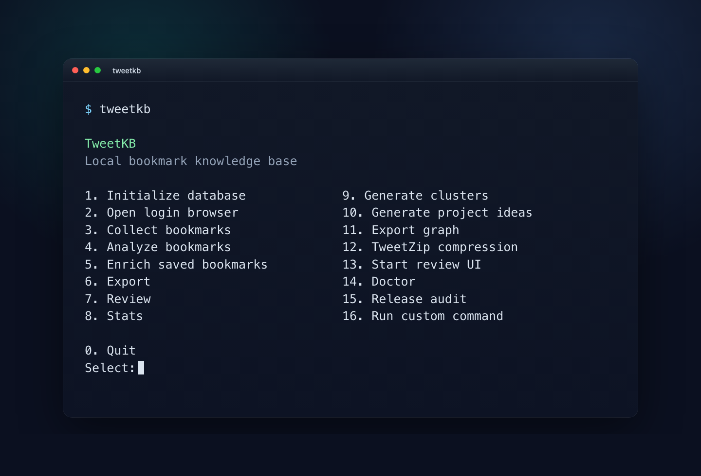

# Terminal Demo

Bare `tweetkb` prints usage and exits. It does not open a menu.

```bash
tweetkb tui          # search + related
tweetkb wizard       # numbered command menu
tweetkb search rust
tweetkb digest
```


